# Somerville City Council Item Flowchart

A visual guide to selected procedural state changes for items before the [Somerville, Massachusetts City Council](https://www.somervillema.gov/departments/city-council).

**[Open the full-size chart](https://raw.githubusercontent.com/r00k/somerville-city-council-flowchart/main/flowchart.svg)**

[](https://raw.githubusercontent.com/r00k/somerville-city-council-flowchart/main/flowchart.svg)

## About this version

This project builds on [Ben Wheeler's original flowchart](https://github.com/benjiwheeler/somerville-city-council-flowchart). Thank you to Ben for creating and sharing it.

The original chart was treated as authoritative for procedural content. This version preserves its transitions, conditions, vote thresholds, and outcomes while reorganizing the presentation to make the paths easier to scan.

## Reading the chart

- Numbered sections provide a reading order; not every item passes through every section.
- Lettered panels separate committee work and Council reconsideration or override procedures from the main path.
- Dashed arrows de-emphasize loops, returns, and cross-stage routes. They do not indicate a different legal effect or degree of certainty.
- Pills beginning with `↩` or `→` refer to an existing state elsewhere in the chart; they are not additional procedural states.

Colors retain the original chart's categories:

| Color | Meaning |
| --- | --- |
| Teal | Source where an item originates |
| Blue | Key lifecycle step |
| Gold | Seldom-used step |
| Green | Positive status development |
| Orange | Intermediate status development |
| Red | Negative status development |

## Scope

This is a simplified, City Council-centric orientation aid—not a comprehensive account of municipal decision-making.

## Editing and rendering

The editable source is [`flowchart.mmd`](./flowchart.mmd). To regenerate the SVG with Mermaid CLI:

```sh
npx -y @mermaid-js/mermaid-cli -i flowchart.mmd -o flowchart.svg -b transparent
```
